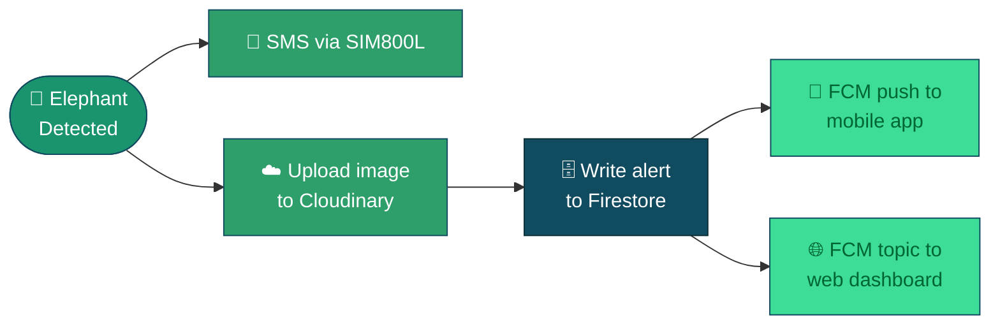

<div align="center">


<a href="https://github.com/PabasaraIlankoon/elevision-device">
  
</a>

<br>

[](https://www.raspberrypi.com/)
[](https://www.debian.org/)
[](https://www.python.org/)
[](https://onnx.ai/)
[](https://firebase.google.com/)

[](#-license)


</div>

<p align="center">
Detects elephants in real time using a custom <b>ONNX</b> model, fires an <b>SMS</b> alert over GSM,
uploads evidence images to <b>Cloudinary</b>, and writes structured alerts to <b>Firestore</b> —
instantly visible on the <b>Flutter mobile app</b> and <b>Next.js web dashboard</b>.
</p>

<div align="center">

[Overview](#-what-it-does) • [Hardware](#%EF%B8%8F-hardware) • [Setup](#-setup) • [Configuration](#%EF%B8%8F-environment-variables) • [Repos](#-related-repositories) • [Demo](#-real-alert-as-received-on-a-phone)

</div>


<br>

<p align="center">
  
  &nbsp;
  
</p>

<p align="center"><sub><b>Left:</b> Custom-designed GSM + power regulation HAT mounted on a Raspberry Pi 4 &nbsp;•&nbsp; <b>Right:</b> Weatherproof field enclosure with IR-illuminated camera module</sub></p>

<br>

## 📡 What It Does

When an elephant is detected for **2 consecutive frames**, the device runs a full, fault-tolerant alert pipeline:



| Step | Action | Description |
|:---:|---|---|
| 🅰️ | **SMS** | SIM800L GSM module sends an immediate text to the emergency number |
| 🅱️ | **Image** | Captured frame is uploaded to Cloudinary, returning a public HTTPS URL |
| 🇨 | **Alert** | A Firestore document is written with `imageUrl`, `confidence`, GPS, and timestamp |
| 🇩 | **Push** | An FCM notification is sent to the Flutter mobile app |
| 🇪 | **Web** | An FCM topic notification triggers a real-time update on the web dashboard |

> 🔌 **Offline-resilient:** if internet is unavailable, the SMS still fires immediately and the alert is saved to a local offline queue, then automatically retried once connectivity is restored.

### 📲 Real alert, as received on a phone

<p align="center">
  
</p>

<p align="center"><sub>Live SMS alerts sent by an <code>ELEVISION_RW-001</code> unit deployed on the Palugaswewa Railway Section, including detection time, confidence score, and GPS coordinates</sub></p>


## 🔗 Related Repositories

<div align="center">

| Repo | Description |
|:---|:---|
| 📍 [`elevision-device`](https://github.com/PabasaraIlankoon/elevision-device) | This repo — Raspberry Pi detection unit |
| 🌐 [`elevision-web`](https://github.com/PabasaraIlankoon/elevision-web) | Next.js web dashboard |
| 📱 [`elevision-app`](https://github.com/PabasaraIlankoon/elevision-app) | Flutter mobile app |

</div>

## 🛠️ Hardware

| Component | Details |
|---|---|
| **Board** | Raspberry Pi 4 (aarch64, Debian Bookworm) |
| **Camera** | USB or CSI camera (auto-detected at indices `1, 0, 2, 3`) |
| **GSM module** | SIM800L — GPIO14 (RX), GPIO15 (TX), GPIO27 (RST) |
| **LED indicator** | GPIO17 — ON when elephant present |
| **Power** | Pi via USB-C, SIM800L via separate 4V regulated supply |
| **Custom HAT** | Purpose-built PCB integrating SIM800L, voltage regulation, and switching circuitry |

### 🧩 Custom PCB — Designed In-House

A dedicated HAT was designed to cleanly integrate the SIM800L GSM module, buck-converter power regulation, IR illumination control, and battery backup directly on top of the Raspberry Pi.

<p align="center">
  
</p>

<p align="center"><sub>PCB layout — SIM800L footprint, Pi/IR/BAT headers, switch header, and buck-converter input/output pads. Designed by Pabasara Ilankoon.</sub></p>


## 📂 File Structure

```
elevision/
├── security.py           # main entry point — camera loop, inference, alert pipeline
├── detection_config.py   # all config constants loaded from .env
├── firebase_helper.py    # Cloudinary upload + Firestore writes + FCM notifications
├── gsm_controller.py     # SIM800L serial driver (AT commands)
├── led_controller.py     # GPIO LED control
├── onnx_detector.py      # ONNX model wrapper — preprocessing + inference + parsing
├── offline_queue.py      # persists alerts to disk when offline, retries later
├── elevision.service     # systemd service file — auto-starts on boot
├── requirements.txt      # Python dependencies
├── .env.example           # environment variable template (copy to .env and fill in)
├── images/                # README assets (PCB photos, enclosure, sample alerts)
└── .gitignore
```

> ⚠️ `firebase-key.json`, `.env`, `models/`, `alerts_images/`, and `logs/` are **not committed**.

## 🚀 Setup

<details open>
<summary><b>1. Clone and create a virtual environment</b></summary>

```bash
git clone https://github.com/PabasaraIlankoon/elevision-device.git /home/pi/elevision
cd /home/pi/elevision
python3 -m venv venv
source venv/bin/activate
pip install -r requirements.txt
```
</details>

<details>
<summary><b>2. Configure environment variables</b></summary>

```bash
cp .env.example .env
nano .env
```

Fill in all values — see the [Environment Variables](#%EF%B8%8F-environment-variables) table below.
</details>

<details>
<summary><b>3. Add the Firebase service account key</b></summary>

Download `firebase-key.json` from:
**Firebase Console → Project Settings → Service Accounts → Generate new private key**

Place it at `/home/pi/elevision/firebase-key.json`.
</details>

<details>
<summary><b>4. Add the ONNX model</b></summary>

Place your trained model at:

```
/home/pi/elevision/models/elephant_model.onnx
```

> The model is not committed to Git due to its size. Back it up to Google Drive after every training run.
</details>

<details>
<summary><b>5. Create required directories</b></summary>

```bash
mkdir -p /home/pi/elevision/logs
mkdir -p /home/pi/elevision/alerts_images
```
</details>

<details>
<summary><b>6. Install the systemd service</b></summary>

```bash
sudo cp elevision.service /etc/systemd/system/
sudo systemctl daemon-reload
sudo systemctl enable elevision
sudo systemctl start elevision
```

✅ The system will now start automatically on every boot.
</details>

## ⚙️ Environment Variables

| Variable | Description | Default |
|---|---|---|
| `FIREBASE_PROJECT_ID` | Firebase project ID | `elevision-606a9` |
| `FIREBASE_KEY_PATH` | Path to service account key | `/home/pi/elevision/firebase-key.json` |
| `DEVICE_ID` | Unique device identifier | `RW-001` |
| `DEVICE_NAME` | Human readable location name | `Palugaswewa Railway Section` |
| `DEVICE_LAT` | GPS latitude | `8.0475` |
| `DEVICE_LNG` | GPS longitude | `80.6932` |
| `CONFIDENCE_THRESHOLD` | Minimum detection confidence (0–1) | `0.55` |
| `ALERT_COOLDOWN_SECONDS` | Minimum seconds between alerts | `300` |
| `CAMERA_INDEX` | OpenCV camera index | `0` |
| `MODEL_PATH` | Path to ONNX model | `/home/pi/elevision/models/elephant_model.onnx` |
| `EMERGENCY_SMS_NUMBER` | SMS recipient (international format) | `+94XXXXXXXXX` |
| `CLOUDINARY_CLOUD_NAME` | Cloudinary cloud name | — |
| `CLOUDINARY_API_KEY` | Cloudinary API key | — |
| `CLOUDINARY_API_SECRET` | Cloudinary API secret | — |
| `GSM_PORT` | Serial port for SIM800L | `/dev/ttyS0` |
| `GSM_BAUD` | GSM baud rate | `9600` |
| `GSM_RST_PIN` | GPIO BCM pin for GSM reset | `27` |
| `LED_PIN` | GPIO BCM pin for LED | `17` |

## 🧪 Running Manually (for testing)

Stop the service first, then run manually so you can see output directly:

```bash
sudo systemctl stop elevision
cd /home/pi/elevision
source venv/bin/activate
python3 security.py
```

Watch live logs in a second terminal:

```bash
tail -f /home/pi/elevision/logs/elevision.log
```

When done testing, hand back to systemd:

```bash
sudo systemctl start elevision
```

## 🧰 Useful Commands

```bash
# check service status
sudo systemctl status elevision

# restart after a code change
sudo systemctl restart elevision

# stop the service
sudo systemctl stop elevision

# view live logs
tail -f logs/elevision.log

# view last 100 log lines
tail -100 logs/elevision.log

# check GSM signal (run while service is stopped)
source venv/bin/activate
python3 -c "from gsm_controller import GSMController; g = GSMController(); print(g.check_module())"
```

## 🗄️ Firestore Alert Document Structure

Each detected elephant writes a document to the `alerts` collection:

```json
{
  "timestampMs": 1781542891083,
  "imageUrl": "https://res.cloudinary.com/...",
  "confidence": 0.928,
  "deviceId": "RW-001",
  "locationName": "Palugaswewa Railway Section",
  "latitude": 8.0475,
  "longitude": 80.6932,
  "status": "new"
}
```

## ☁️ Third-Party Services

| Service | Purpose | Free tier |
|---|---|---|
| [Firebase Firestore](https://firebase.google.com) | Real-time alert database | 1GB storage, 50k reads/day |
| [Firebase FCM](https://firebase.google.com) | Push notifications | Free |
| [Cloudinary](https://cloudinary.com) | Alert image hosting | 25GB storage |


## 🎯 Project Context

This device is part of **Elevision** — an elephant detection and early warning system developed as a final year Individual Design Project (IDP). The system aims to reduce human-elephant conflict along railway sections in Sri Lanka by alerting railway operators and nearby communities in real time.

## 📄 License

Academic project — all rights reserved.

<div align="center">


<sub>Built with 🐘 by <b>Pabasara Ilankoon</b></sub>

</div>
